# **MoneyCat**
### An intuitive app for university students to track their expenses, analyze spending habits, and improve financial decision-making.

---

## Motivation

### Our Investigation
Our survey of college students revealed two critical insights:
1. **Do students track their spending?**
   - Approximately **46.7% of students track their spending**, while **53.3% do not**.  
   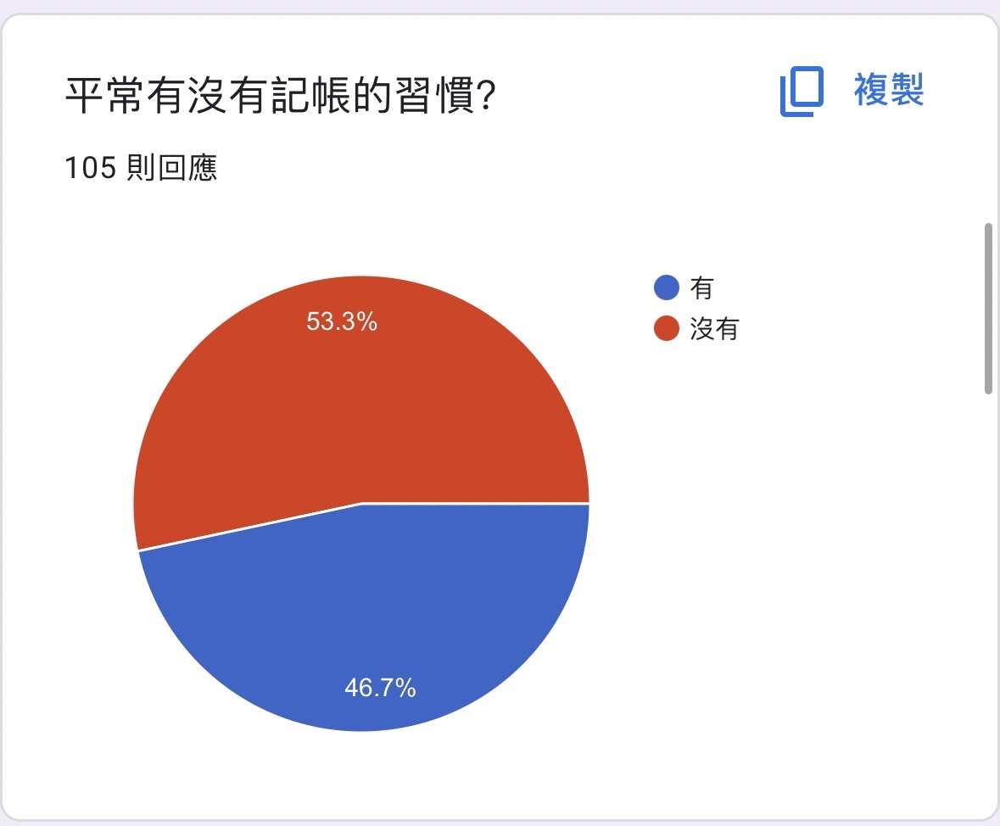

2. **Does tracking spending change financial habits?**
   - Among those who do track their spending, only **51% successfully changed their financial habits**, while **49% did not**.  
   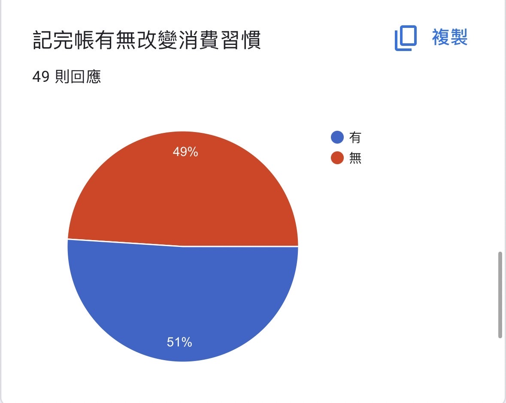

These results show that while many students try to track their spending, doing so does not necessarily lead to meaningful changes in their financial habits.

### Questions to Current Apps
Despite the availability of numerous expense tracking apps, several questions remain unanswered:
- **Does tracking expenses really help us save money?**
- **How can expense tracking become a more practical tool for college students, especially given the increasing financial pressure they face?**
- Many existing apps focus on making expense tracking **fun** rather than **effective**, prioritizing gamified features over genuinely helping users save money.

### Our Aim
To address these gaps, our goal is to create an app that emphasizes **practicality and effectiveness**. MoneyCat is designed with three main functions to help students not only track their expenses but also make better financial decisions:
- **Need vs. Want Categorization:** Students can identify whether their expenses are necessities or discretionary, allowing for clearer financial planning.
- **KANO Analysis:** A unique feature that helps users analyze and rate their expenses based on their impact on satisfaction and financial goals.
- **Personalized Spending Suggestions:** Based on their spending patterns, users receive actionable advice to help them save money and make informed financial choices.

---

## KANO Model Analysis

### KANO Model Overview
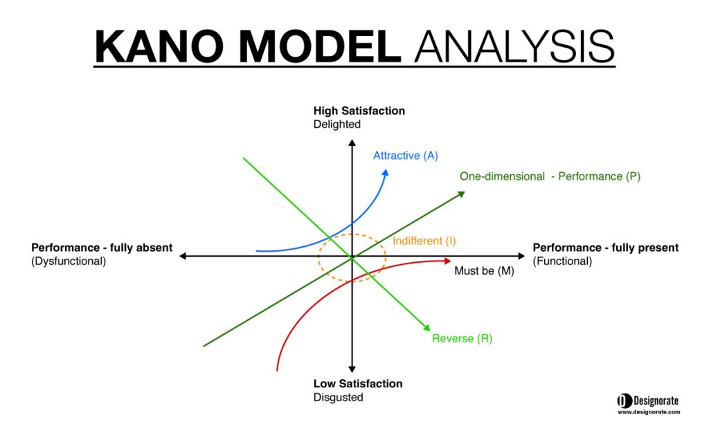

The **KANO Model** is a framework we use to analyze and categorize user needs. It allows us to evaluate the impact of different features on user satisfaction and prioritize their implementation. The model breaks down features into the following categories:
- **Basic Needs (Must-be Requirements):** Essential features that users expect. Failing to meet these needs results in dissatisfaction.
- **Performance Needs (One-dimensional):** These needs directly impact satisfaction. The more these needs are fulfilled, the higher the satisfaction.
- **Attractive Needs (Excitement):** Unexpected features that delight users and exceed their expectations.
- **Indifferent Needs:** Features that do not significantly impact user satisfaction.
- **Reverse Needs:** Features that, if overemphasized, may lead to dissatisfaction.

### Questionnaires for User Needs Analysis
We use the following questions to evaluate user requirements based on the KANO Model:
- **Basic Needs:** 
  - Q1: Does this product help improve your life? (1 = Not at all, 5 = Very much)
  - Q2: Would the absence of this product negatively impact your life? (1 = Not at all, 5 = Very much)
- **Attractive Needs:**
  - Q3: Does this product bring happiness or excitement? (1 = Not at all, 5 = Very much)
  - Q4: Would the absence of this product make you feel regret? (1 = Not at all, 5 = Very much)
- **Performance Needs:**
  - Q5: Does this product meet your expected value? (1 = Not at all, 5 = Very much)
  - Q6: Do you think other products could surpass this one's value? (1 = Not at all, 5 = Very much)
- **Indifferent Needs:**
  - Q7: How would you feel if the product came with a free gift? (1 = Very happy, 5 = No feeling at all)
  - Q8: How would you feel if the product did not come with a free gift? (1 = Very happy, 5 = No feeling at all)

### Calculation of Better-Worse Coefficients
The KANO Model helps derive the **Better-Worse Coefficients**, which are used to evaluate the impact of features on satisfaction:
- **Better Coefficient (Positive Impact):** Measures how strongly the presence of a feature improves user satisfaction.
- **Worse Coefficient (Negative Impact):** Measures how strongly the absence of a feature decreases user satisfaction.

Formulas:
- **Better Coefficient** = (Calculated Value based on survey responses)
- **Worse Coefficient** = (-1) × (Calculated Value based on survey responses)

---

## Project Demo

### Reports Page

The Reports Page serves as the analytical hub of the app, where users can gain insights into their spending patterns and receive tailored suggestions.

#### Key Features:

1. **Analyze an Expense**  
   Users can analyze an expense to determine its impact on their overall satisfaction and financial priorities. This is done through the KANO analysis process.  
   

2. **Reports Chart**  
   The chart visualizes the user's expenses as colored dots based on their category. The chart dimensions are derived from the **Better-Worse coefficients** of each expense:
   - **X-axis (Horizontal):** Represents whether an expense is a basic need or one-dimensional performance feature.
   - **Y-axis (Vertical):** Represents how attractive or indifferent the expense is.
   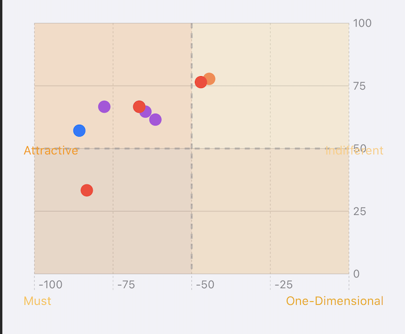

3. **Recommendation Box**  
   The recommendation box provides tailored suggestions based on the analyzed expenses:
   - **Criteria:** Highlights the importance of a particular type of expense.
   - **Suggestions:** Offers actionable advice to improve financial habits.
   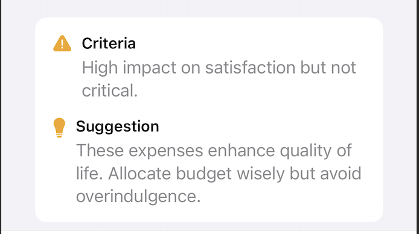

### Add Expense Page

The Add Expense Page allows users to quickly and easily input their expenses, ensuring a seamless experience for tracking their spending.

#### Key Features:

1. **Input Expense Details**
   Users can input the following details for each expense:
   - **Amount:** Specify the amount spent.
   - **Category:** Choose a category for the expense (e.g., food, entertainment, transportation).
   - **Date:** Select the date of the expense.
   - **Note:** Add optional notes for additional context.
   - **Need or Want:** Categorize the expense as a necessity or a discretionary item.
   

2. **User-friendly Interface**
   The interface is designed to minimize friction:
   - Dropdowns and pickers make selection quick and intuitive.
   - Clear labeling ensures users can easily input and categorize their expenses.

### Expense Overview Page

The Expense Overview Page provides users with a detailed and visualized breakdown of their spending habits. It combines clear summaries, interactive charts, and advanced filtering options to ensure ease of use and financial insight.

#### Key Features:

1. **Interactive Bar Chart and Pie Chart Visualization**
   - **Bar Chart:** Displays overall spending trends across different time ranges (week, month, year). This chart is particularly useful for identifying patterns and monitoring spending over time.
   - **Pie Chart:** Offers a percentage breakdown of spending by category. This allows users to clearly understand the proportion of their expenses in areas like food, entertainment, or utilities.
     
   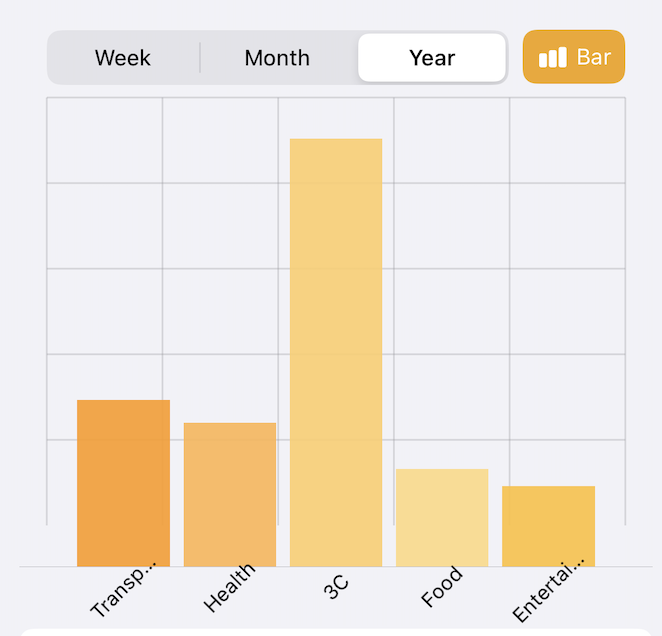
   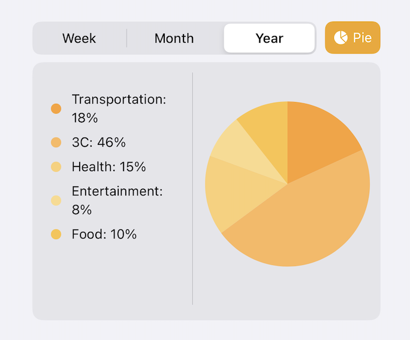

2. **Top Box Summary**
   - **Total Spending:** The top box dynamically updates to show the total amount spent for the selected time range (week, month, or year).
   - **Top Spending Category:** Highlights the category where the highest expenditure occurred. For instance, if a user spent the most on "3C" during the month, the top category will display this result prominently.
     
   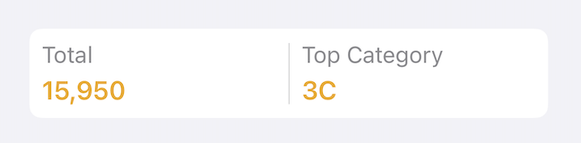

3. **Advanced Search and Filter Options**
   - **Search Bar:** Users can search for specific expenses by keywords, such as "groceries" or "rent."
   - **Filter Options:** Filters allow users to organize their expenses based on criteria like:
     - Alphabetical order (A-Z or Z-A)
     - Expense amount (low-to-high or high-to-low)
     - Date of entry

    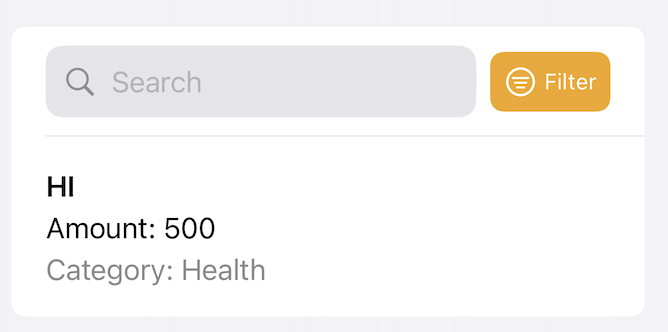

5. **Detailed Expense List**
   - Below the charts, users can review a detailed list of all expenses for the selected time range.
   - Each entry includes:
     - **Expense Title**
     - **Amount**
     - **Category**
     - **Additional Notes**
   Example Entry:
   - **Title:** HI
   - **Amount:** $500
   - **Category:** Health
     
 

### Settings Page

The Settings Page provides users with options to customize the app and manage their preferences effectively. It ensures the app adapts to individual needs, enhancing user experience.

#### Key Features:

1. **Add Category**
   - Users can create their own categories by:
     - **Selecting a color** for the category to make it distinct on the reports chart.
     - **Naming the category**, allowing better tracking and customization.
   - This feature ensures that reports are personalized and visually clear.
   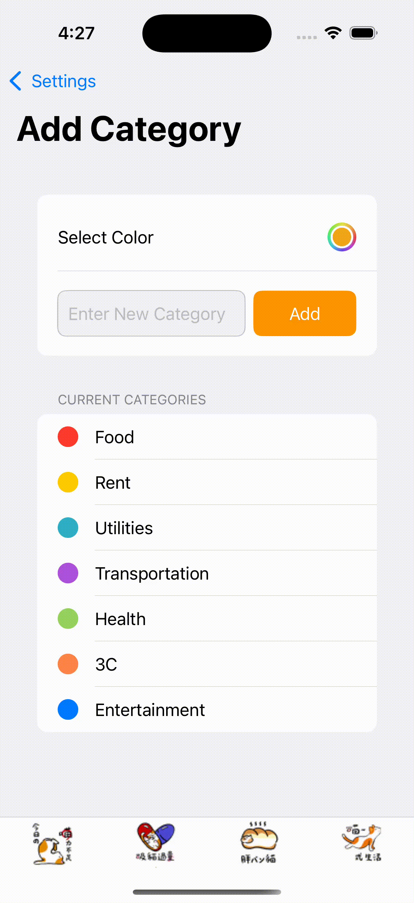

2. **Other Customization Options**
   The settings page includes additional features to manage the app:
   - **Language Settings:** Choose the app’s language based on user preference.
   - **Theme Settings:** Switch between different color themes to personalize the app’s appearance.
   - **Notification Preferences:** Manage reminders and notifications for expense tracking.

3. **Account and Data Management (Unfinished)**
   - **User Profile:** Manage account details and preferences.
   - **Account Management:** Update or modify account settings.  
   - **Erase All Data:** Clear all stored expenses and reset the app. This is useful for starting fresh or managing privacy.

   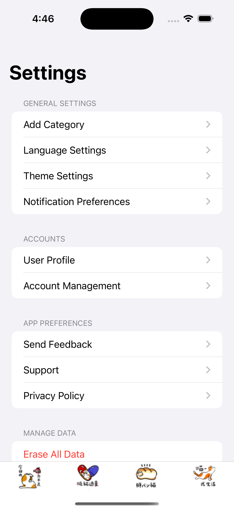

---

## Conclusion

MoneyCat is designed to help users better understand and control their spending habits. Through features like customizable categories, insightful reports, and expense analysis powered by the KANO model, the app ensures that users can make informed financial decisions.

### Why MoneyCat Stands Out:
- Combines expense tracking with meaningful insights and actionable recommendations.
- Offers a user-friendly interface tailored for college students.
- Empowers users to categorize and visualize expenses effectively, enhancing financial literacy.
